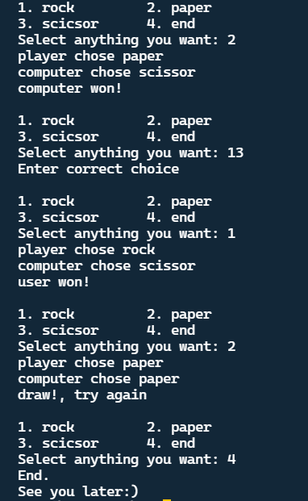

## Rock Paper Scissors ✊  🖐️ ✌
This game is developed using C Programming using <em><b>rand</b></em> function and some user inputs.

### About the game
- In this game, it generates a random one from <strong>Rock,Paper,scissors</strong> and User also need to give input.
- This iterates over loop till user asks to end the game. 

### Instructions to play game
- Run this program and give input (Rock Paper Scissor).
- Give only valid input, In case if you give invalid input it asks to give the valid input.
- Based on user input and input generated by compiler,you may <em>Win or lose or tie </em>.
- That's it. Now go and challenge the computer 💻. Let's see who will win  🔥

### Setup Instuctions
1. Download this repo as zip and extract.
2. Run the code in your favourite IDE.

### Sample Output

<!-- 
Happy Rock Paper Scissors
 -->

